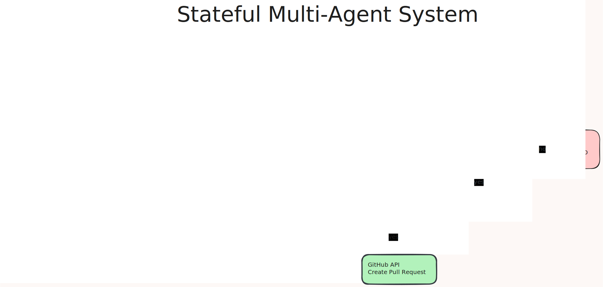

# 🤖 AI Engineer Agent (Autonomous Multi-Agent System)

An end-to-end **autonomous AI system** that reads GitHub issues, generates code fixes, validates them in a sandbox, and **creates pull requests automatically**.

This project simulates a real-world software engineering workflow using **collaborating AI agents with iterative self-correction**.

---

## 🚀 What It Does

✔ Reads issue  
✔ Breaks it into steps  
✔ Analyzes repository  
✔ Generates a fix using LLM  
✔ Runs tests in Docker sandbox  
✔ Commits & pushes changes  
✔ Creates Pull Request automatically  

---

## 🔥 Key Features

- Multi-agent architecture (Planner, Researcher, Coder, Tester, Executor, Reviewer)
- Stateful execution with shared memory
- Retry loop with convergence control
- Docker-based safe code execution (Pytest sandbox)
- Automatic Git operations (commit, push, branch handling)
- Automatic Pull Request creation via GitHub API
- Structured logging for observability
- Deterministic mock LLM for testing

---

## 🧠 Architecture

<p align="center">
  
</p>

<p align="center">
  <i>Multi-agent execution pipeline with retry loop and decision-based flow</i>
</p>

---

## 📊 Execution Flow

---

## Project Structure 
```text
ai-engineer-agent/
│
├── app/
│   ├── agents/              # Individual agents (core logic units)
│   │   ├── planner.py
│   │   ├── researcher.py
│   │   ├── coder.py
│   │   ├── tester.py
│   │   ├── executor.py
│   │   └── reviewer.py
│   │
│   ├── core/                # Orchestration + system backbone
│   │   ├── orchestrator.py
│   │   ├── state.py
│   │   ├── logger.py
│   │   └── config.py
│   │
│   ├── services/            # External integrations (LLM, metrics)
│   │   ├── llm.py
│   │   └── metrics.py
│   │
│   ├── tools/               # Utilities (future integrations)
│   │   ├── github.py
│   │   ├── docker_exec.py
│   │   └── file_utils.py
│   │
│   └── main.py              # Entry point
│
├── docs/                    # Architecture diagrams
│   └── multi.svg
│
├── logs/                    # Execution logs
│   └── system.log
│
├── tests/                   # (optional) test cases
│
├── .env                     # Environment variables (not committed)
├── .gitignore
├── requirements.txt
└── README.md
```
---

## ⚙️ Tech Stack

- Python  
- LangGraph (stateful orchestration)  
- Docker + Pytest (sandboxed execution)  
- Git + GitHub API  
- Requests / dotenv  

---

## 📊 Results

- Iterative execution with failure recovery  
- Converges in ~3 iterations (mock setup)  
- Fully traceable execution flow  

---

---

## ▶️ How to Run

```bash
git clone https://github.com/Harshvardhan-2005/ai-engineer-agent.git
cd ai-engineer-agent

python3 -m venv venv
source venv/bin/activate

pip install -r requirements.txt
```
## 🧠 Author

Harshvardhan Kumar Arya
